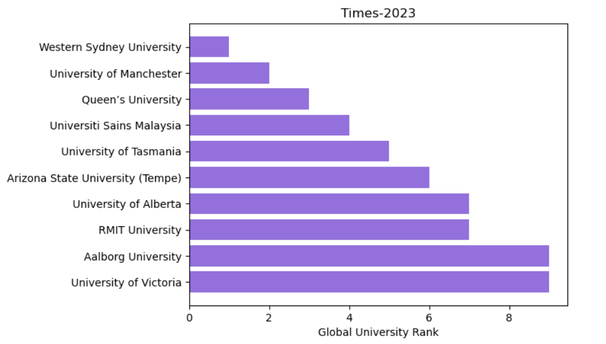
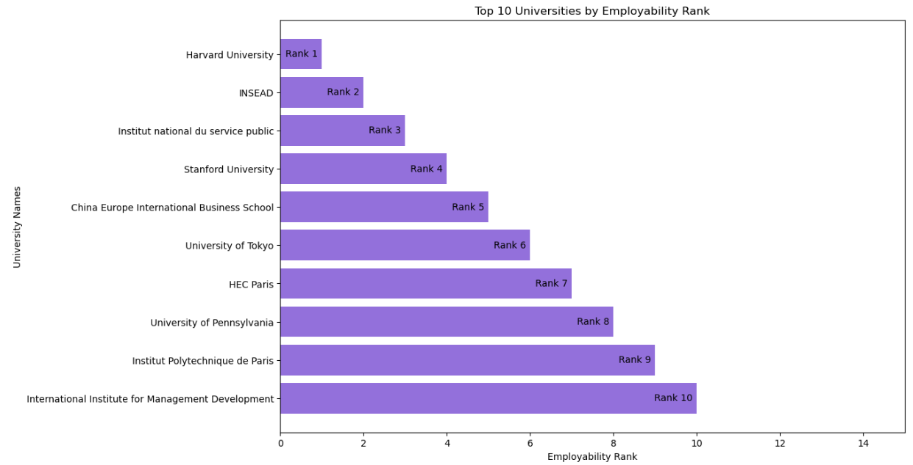
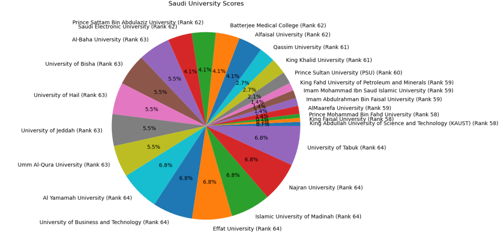
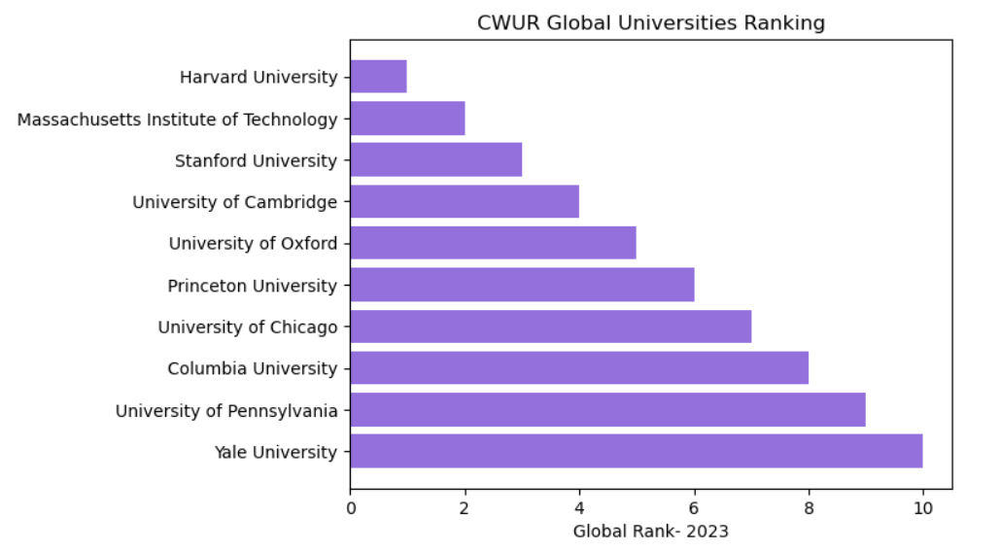
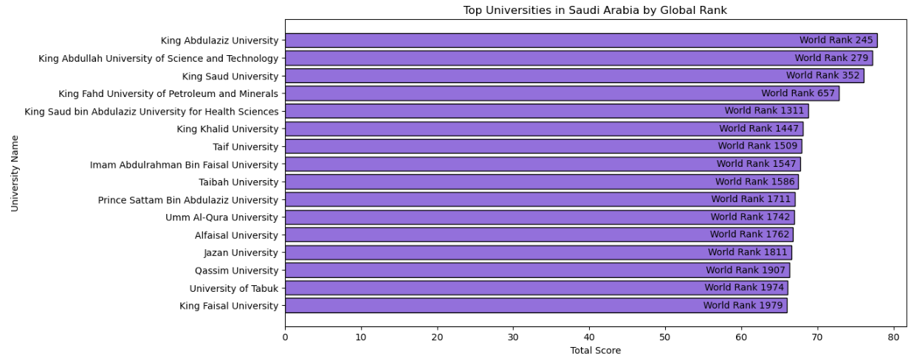
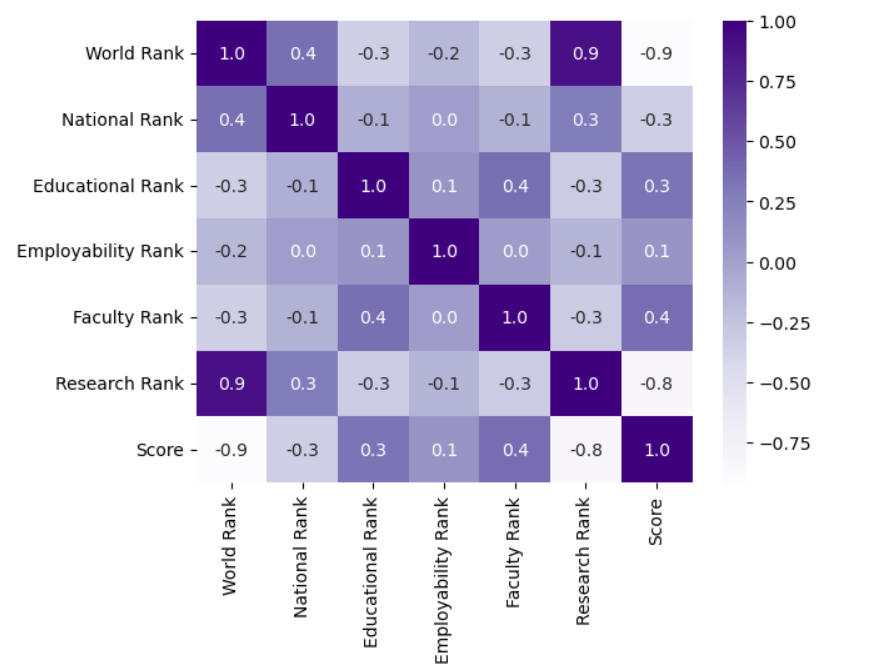
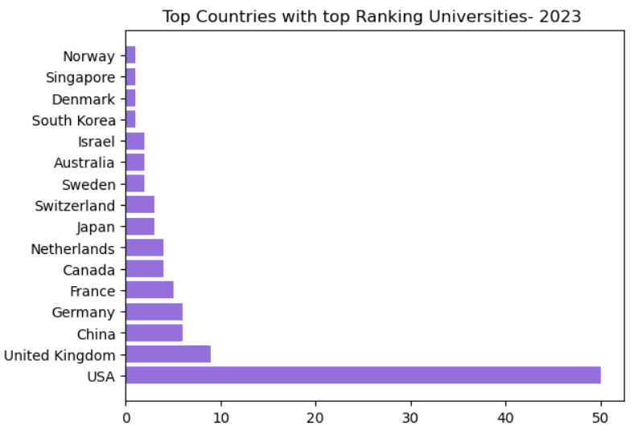
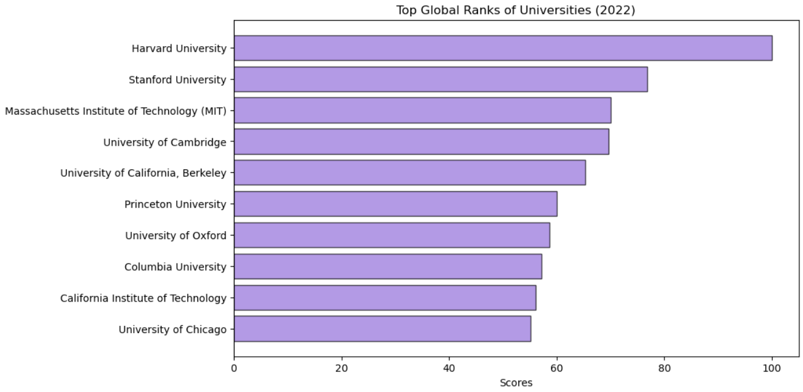
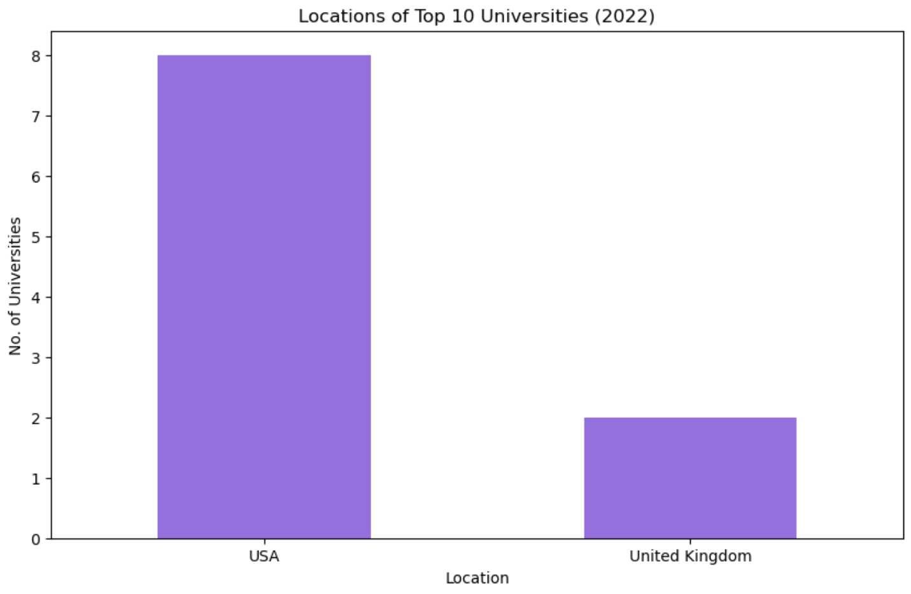
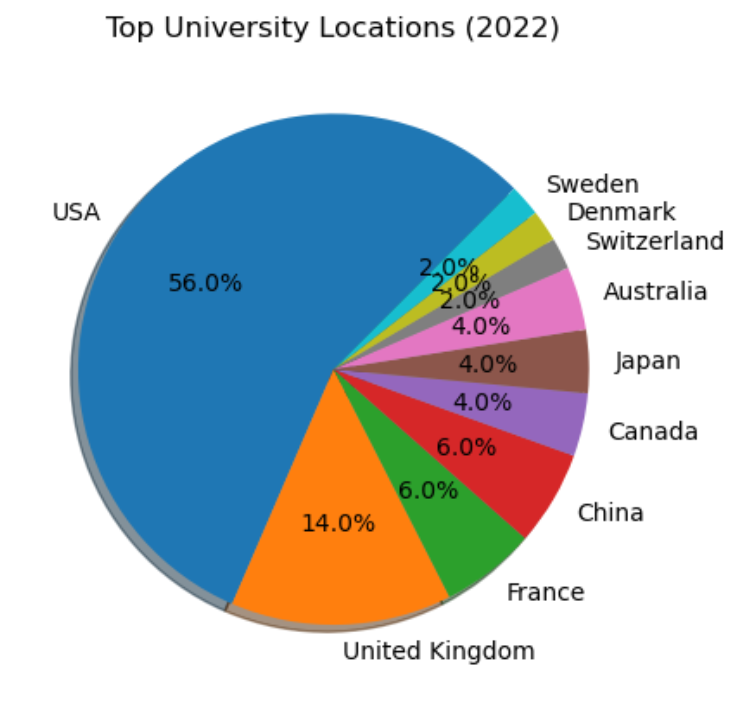

# Usecase- Project-2
The purpose of this project is to apply the Exploratory Data Analysis (EDA) skills we learned as part of the Data Science and Machine Learning Bootcamp offered by Tuwaiq.

**Lead Instructor**: Eng. Esraa Madhi, Data scientist | AI Educator

**Teaching Assistant**: Refal Alboqami, Data scientist

**Teaching Assistant**: Yasser Almubaddil, Data scientist

The purpose of Exploratory Data Analysis (EDA) is to formulate an understanding of a dataset, listen to what the data has to say, and have a feel of what it represents to tackle business problems through extracting insights.

The goal is to understand the data structure which would help in finding potential variables to develop Machine Learning models, look for data quality issues and fix them, while also looking for more questions that would benefit us.

## Datasets Provided:
- There are 3 datasets that has been given to us to do an EDA and problem statements to answer them through our data.
- We will explain our work through the use of each dataset

____________________________________________________

### Dataset 1- Times Higher Education:
- Data Profiling:
	- Descriptive analysis:
		-  This dataset consists of three of 1591 rows and 20 Columns.
		-  Values types are Float and Objects.
	-  7 Dimentions:
		- Reliablity:** Yes, the data that was provided in Kaggle is reliable and was collected from the original source which is “Times Higher Education”. This is considered a reliable source because they have been providing university ranking since 2004 and they have been collecting data via surveys and academic institutions. https://www.timeshighereducation.com/rankings/impact/overall/2023
 
		- Timeliness: The data is not up to date. It is 2023 data and there is 2024 data but it is not open therefore we can't use it. There is a solution that we use data scraping techniques but it is out of our expertise.

		- Consistency: Yes, the data is consistent throughout all the columns, and the data are the same as the data source.

  		- Relevance(Sample Selection): Yes, the given data is relevant and can be used to answer the questions, because the questions ask about universities global ranking.
  		-  Relevance(Variable Selection): Dropped the ‘ranking-institution-title href’ column because it contains the universities website links and it is irrelevant.

  		- Uniqueness: Yes, the data is unique, there are no duplicated rows.

  		- Completeness: Every column has missing values except ‘Rank’, ‘University Name’ and ‘scores’.

  		- Check Accuracy: The data types were not uniformed. 
 
 - Data Cleaning:
	- Renamed all the columns to shorter and more optimized names.
	- And converted all of the 8 scores columns to strings becuase they had floats and strings as values.
	- Removes the +, =, - signs from the Rank column.
	- Removed the - sign from the 8 scores columns from values that had range such as 7.9-53.
	- Did the same for Total scores column.
	- Removed the \n from the name of the universities.
	- Converted the 8 scores columns and Total scores to Floats and the Rank to int.
	- Filled the missing values in the column location from locations from the Central World dataset.
	- Filled the remaining values of location with Unknown!.
	- Fixed the Column Rank because it skipped values such as 1, 2, 3, 3, 5 and added the solution to a new column called Rank_new.
   
#### Did the Data Answer Our Questions?

**Yes**, the data answered 4 out of 5 questions. Here are the details:

1. **Which universities are ranked in the top 10 globally?**
   
   

2. **Which universities are ranked in the top 10 for employment outcomes**

   
  
3. **What positions do universities in Saudi Arabia hold within the global rankings?**
    
   

4. **Considering various factors (variables) such as employment rankings, research rankings, and others, which has the most significant impact on a 
            university's overall ranking?**

Accourding to the data source website, they said the follwing: 
SDG 17 accounts for 22 per cent of the total score, while the other SDGs each carry a weighting of 26 per cent.
Evidence: https://www.timeshighereducation.com/world-university-rankings/impact-rankings-2024-methodology
 SDG 17 has more privilage for taking its rank, it is the parthnership for the goals
 ''Any university that provides data on SDG 17 and at least three other SDGs is included in the overall ranking''.
 ''A university’s total score in a given year is calculated by combining its score in SDG 17 with its best three results on the remaining 16 SDGs''.

5.  **Is there a correlation between national and global university rankings, and based on this information, can you recommend a country that 
             appears to have a high concentration of top-ranked universities?**

The Times Impact ranking does not provide any clue about the national rank, only the global rank.

__________________________________________________________

   
### Dataset 2- Center World University Ranking:
- Data Profiling:
  - Descriptive Analysis
    World Rank University CWUR
    2000 Rows
    9 columns
    Data consists of a mix of Strings, integers, and floats types
    Null values* are present, 1562 Rows affected
- Reliability:
  - Yes source is reliable and data was collected from the data source itself: World University Rankings 2024 | Global 2000 List | CWUR
  - https://cwur.org/2023.php
- Timeliness:
  - The data provided  in kaggle is up to date but just about a year ago, which is 2023.
- Consistency:
  - Yes, data is consistent with the data source.
- Relevance: 
  - sample selections:
   - Yes, the data provided is relevant to the objective questions because the questions ask about global ranking and the data source considered      to be world 	wide ranking.
  - Variable selections:
   - We will not remove any of the columns because we need all column  to answer our objective questions.
- Uniqueness:
   - the data contains no duplicated rows,The rank columns can have duplicate values in the possibility 2 universities achieved the same rank, therefore       we will not consider it an issue.
- Completeness:
   - There are zero null values but we null values with dashes.
- Accuracy:
   - We checked the accuracy and we found some data types are string while they are representing a number (int), so we changed them. 
- Data Cleaning:
   - rank is stirng so we convrted to int with out any string ,from (1Top 0.1%) to (1), and in University Name from (Stanford University
  Education: A+; Employability: A+; Faculty: A+; Research: A+) to (Stanford University) 

#### Did the Data Answer Our Questions?

**Yes**, the data answered all of the 5 questions. Here are the details:

1. **Which universities are ranked in the top 10 globally?**
   
   

2. **Which universities are ranked in the top 10 for employment outcomes**

   
  
3. **What positions do universities in Saudi Arabia hold within the global rankings?**
    
   

4. **Considering various factors (variables) such as employment rankings, research rankings, and others, which has the most significant impact on a 
            university's overall ranking?**
   
   

5.  **Is there a correlation between national and global university rankings, and based on this information, can you recommend a country that 
             appears to have a high concentration of top-ranked universities?**

       

_________________________________________

### Dataset 3- Shngahai Ranking:
#### Data Profiling:
- Descriptive Analysis:
  - Shanghai Academic Ranking of World Universities (ARWU)
  - 1000 Rows
  - 6 columns
  - Data consists of a mix of Strings and floats types
  - No Null values

- Data quality checks:
Data quality checks involve the process of ensuring that the data is accurate, complete, consistent, relevant, and reliable.
Here are typical steps involved in checking data quality:

1. Reliability:
the data that was provided in Kaggle is reliable and was collected from the original source which is “Shunghai Ranking”. 
This is considered a reliable source because they have been providing university ranking since 2003.
https://www.shanghairanking.com/rankings/arwu/2022

2. Timeliness:
The dataset is from 2022, and due to no available extraction or collection source to get the most recent release, we will have to continue with the 2022 version to answer our problem statements.

3. Consistency:
The data seems to be consistent from the get go, no further modifications seem to be required in this regard.

4. Relevance:
The dataset is not relevant to most of our problem statements, however, it can answer a few of the questions.
columns are not useful to us that will be dropped:
   - LOGO: images
   - University Details: URL’s

Note: If we add a location column, it can answer more questions for us, which is what we did in an attempt to cover as much data as possible.

5. Uniqueness:
The data contains no duplicated rows. The rank columns can have duplicate values in the possibility 2 universities achieved the same rank, therefore we will not consider it an issue.

6. Completeness:
The dataset has no null values and all cells are filled.

7. Check Accuracy:
The data requires changes when it comes to data types, some columns need to be changed into an integer.

#### Data Cleaning:
- dropping two columns: LOGO column and University Detail column. 
- unifying Ranking column values to have integers only and dropping old Ranking column
- unifying 'National/Regional Rank' column values to have integers only and dropping old 'National/Regional Rank' column
- making a dictionary from 'University Names_new' and 'Location' columns
- making a list of unique names from the 'world' dataframe to find them in the shanghai dataframe so we can match locations

#### Did the data answered our questions?
**Yes**, but it answered 3 out of the 5 questions. Here are the details:
1. **Which universities are ranked in the top 10 globally?**
   
   

3. **Which universities are ranked in the top 10 for employment outcomes**

   
  
5. **What positions do universities in Saudi Arabia hold within the global rankings?**
    
   

   

   

____________________________________________________________

### What is the best to use for further analysis?
It depends on the factors of each dataset that the entity or business wants to deal with based on their goals, but from our side and depending on the objective questions, we will choose the CWUR dataset because it answers all of them and gives us insight.
Moreover, datasets such as Times Impact inspired us to ask more related questions. 

______________________________
### Team Members:
- Raghad Almalki
- Salman
- Mousa
- Mohammed
- Hatoon Aloqaily

